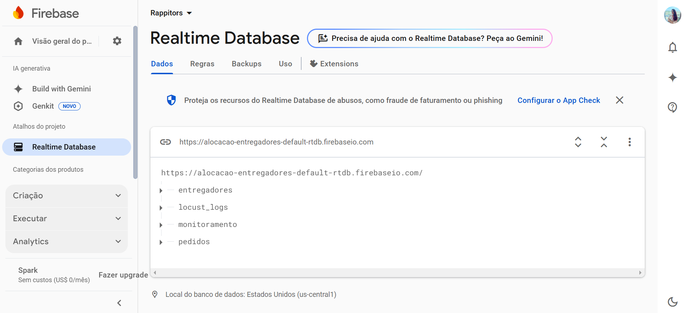
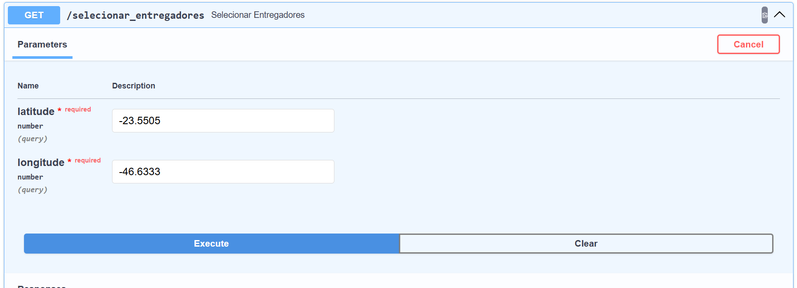
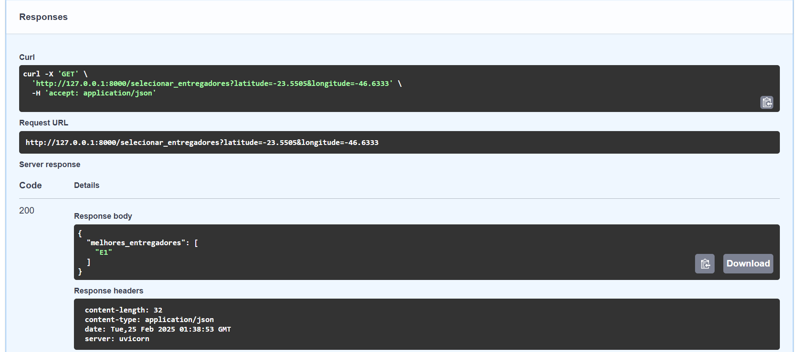
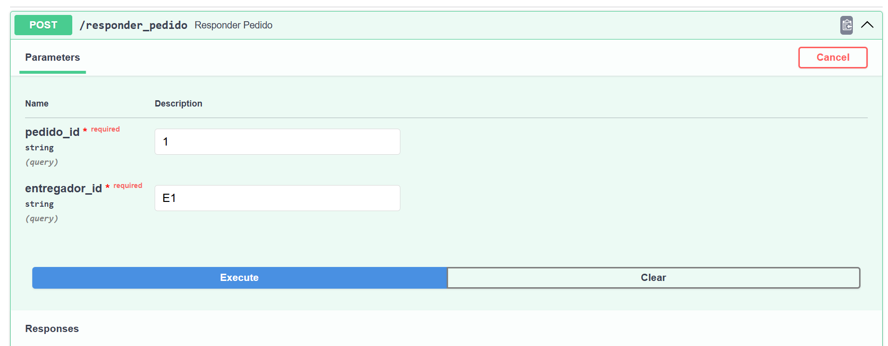
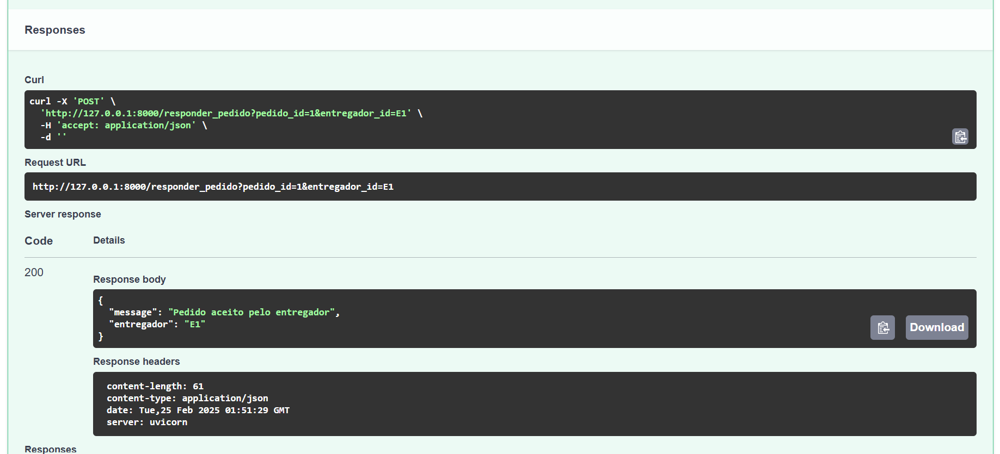
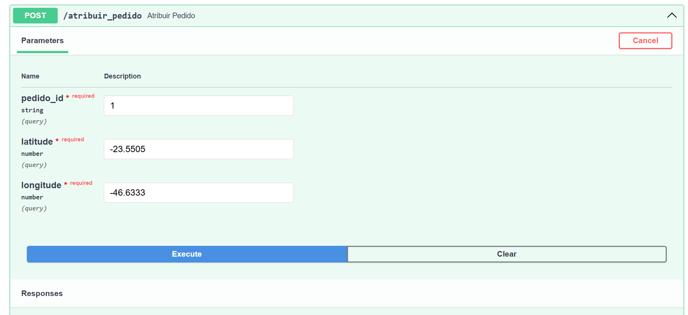
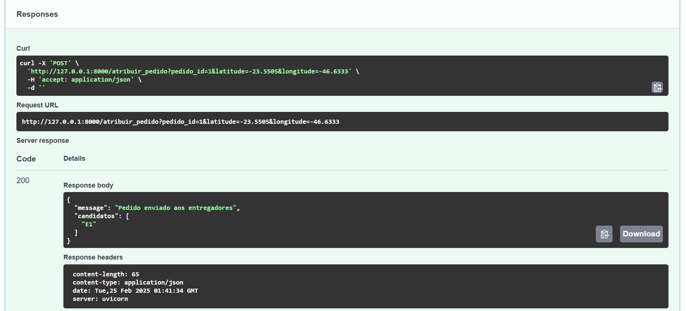
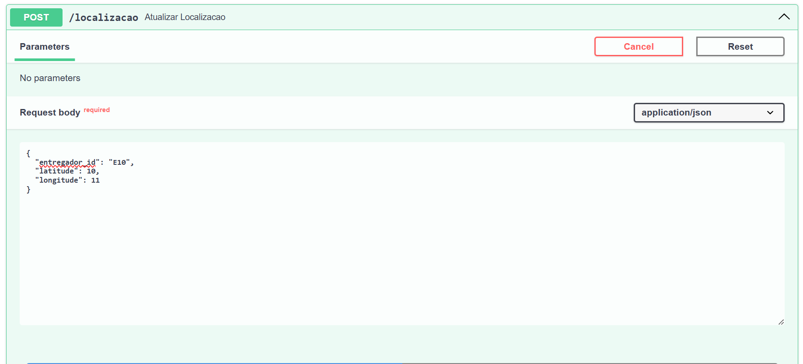
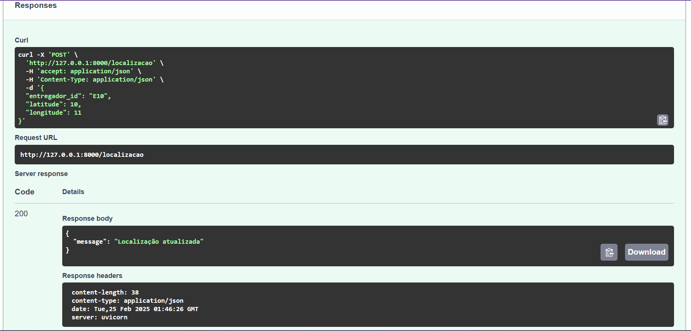
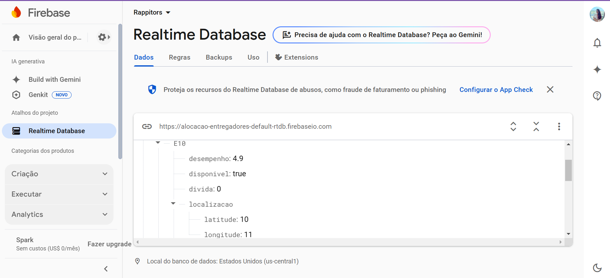

# Sistema de Gerenciamento de Pedidos e Entregadores

## Requisitos Funcionais

### 1. Atribuir Pedido a Entregadores
- **Objetivo**: Atribuir um pedido a entregadores disponíveis dentro de um raio específico da localização.
- **Rota**: `POST /atribuir_pedido`
- **Entrada**:
  - `pedido_id`: Identificador único do pedido.
  - `latitude`: Latitude da localização do pedido.
  - `longitude`: Longitude da localização do pedido.
- **Processo**:
  1. O sistema verifica os entregadores disponíveis e próximos (dentro de um raio de 500 metros).
  2. Os entregadores são ordenados por saldo (quanto mais saldo, melhor).
  3. Se não encontrar entregadores dentro do raio, aumenta o raio em 500 metros e tenta novamente.
  4. O pedido é atribuído aos 3 entregadores mais próximos e com maior saldo.
- **Resposta**:
  - `{"message": "Pedido enviado aos entregadores", "candidatos": melhores_entregadores}`

### 2. Atualizar Localização do Entregador
- **Objetivo**: Permitir que o entregador atualize sua localização em tempo real.
- **Rota**: `POST /localizacao`
- **Entrada**:
  - `entregador_id`: Identificador único do entregador.
  - `latitude`: Latitude atual do entregador.
  - `longitude`: Longitude atual do entregador.
- **Processo**:
  1. O sistema recebe a nova localização do entregador e atualiza o banco de dados.
- **Resposta**:
  - `{"message": "Localização atualizada"}`

## Requisitos Não Funcionais

### 1. Desempenho
- **Objetivo**: Garantir que o sistema consiga encontrar um entregador disponível no máximo **em 3 minutos** de busca.
- **Descrição**:
  - O sistema deve ser capaz de buscar entregadores em tempo real e com o menor tempo de resposta possível. Caso a busca inicial (com raio de 500 metros) não encontre entregadores, o sistema irá aumentar progressivamente o raio de busca (em incrementos de 500 metros) até encontrar entregadores ou atingir o tempo limite de 3 minutos.
  - O tempo máximo para a busca de entregadores será de 3 minutos. Durante esse tempo, o sistema irá expandir a busca e processar até encontrar entregadores ou até que o tempo limite seja atingido.
  - **Critério de sucesso**: A busca por entregadores deverá ser completada dentro de 3 minutos ou o sistema deve retornar uma mensagem informando que não há entregadores disponíveis dentro do raio máximo especificado.

## Uso dos Dados no Firebase

Os dados armazenados no Firebase são utilizados para gerenciar entregadores, monitoramento do sistema e pedidos em tempo real. A estrutura do banco de dados está organizada da seguinte forma:

### 1. **Entregadores**
   - Contém informações sobre cada entregador, incluindo:
     - Nome, saldo disponível, desempenho (avaliação), dívida e lucro.
     - Número de entregas realizadas e status de disponibilidade.
     - Localização em latitude e longitude.

### 2. **Monitoramento**
   - Controla o desempenho do sistema e a atividade dos entregadores:
     - Número de entregadores conectados e total de requisições recentes.
     - Histórico do tempo de resposta e média dos últimos tempos registrados.
     - Registros detalhados de requisições feitas ao sistema.

### 3. **Pedidos**
   - Gerencia os pedidos em aberto e seus candidatos:
     - Lista de entregadores que se candidataram a cada pedido.
     - Identificação do entregador atribuído (se já foi designado).

<div align="center">
  <sub>Figura 01: Banco de Dados - Firebase</sub><br>
  <br>
  <sup>Fonte: Anna Aragão (2025)</sup>
</div>

## Rotas do Projeto

## 🔹 GET /selecionar_entregadores
Seleciona os melhores entregadores disponíveis em um raio específico com base na localização.

## Parâmetros (Query Params)
- `latitude` (float, obrigatório): Latitude do ponto central.
- `longitude` (float, obrigatório): Longitude do ponto central.

## Resposta
- **200 OK**: Lista de entregadores encontrados dentro do raio.
- **200 OK com mensagem**: Se nenhum entregador for encontrado.

## Exemplo de Requisição
```bash
GET /selecionar_entregadores?latitude=-23.5631&longitude=-46.6565
```
<div align="center">
  <sub>Figura 02: GET/selecionar_entregadores</sub><br>
  <br>
  <sup>Fonte: Anna Aragão (2025)</sup>
</div>

<div align="center">
  <sub>Figura 03: GET/selecionar_entregadores</sub><br>
  <br>
  <sup>Fonte: Anna Aragão (2025)</sup>
</div>

***

### 🔹 POST `/responder_pedido`
Aceita um pedido de entrega para um entregador específico.

#### **Parâmetros**
- `pedido_id` (str, obrigatório): ID do pedido.
- `entregador_id` (str, obrigatório): ID do entregador que está aceitando o pedido.

#### **Resposta**
- `200 OK`: Pedido aceito com sucesso.
- `400 Bad Request`: O entregador não está na lista de candidatos.

#### **Exemplo de Requisição**
```json
{
  "pedido_id": "12345",
  "entregador_id": "67890"
}
```

<div align="center">
  <sub>Figura 04: POST/responder_pedido</sub><br>
  <br>
  <sup>Fonte: Anna Aragão (2025)</sup>
</div>

<div align="center">
  <sub>Figura 05: POST/responder_pedido</sub><br>
  <br>
  <sup>Fonte: Anna Aragão (2025)</sup>
</div>

***

## 🔹 POST `/atribuir_pedido`
Atribui um pedido aos melhores entregadores disponíveis dentro do raio.

## Parâmetros
- `pedido_id` (str, obrigatório): ID do pedido.
- `latitude` (float, obrigatório): Latitude do local de entrega.
- `longitude` (float, obrigatório): Longitude do local de entrega.

## Resposta
- **200 OK**: Pedido enviado para os entregadores selecionados.
- **404 Not Found**: Nenhum entregador disponível no raio máximo.

## Exemplo de Requisição
```json
{
  "pedido_id": "12345",
  "latitude": -23.5631,
  "longitude": -46.6565
}
```

<div align="center">
  <sub>Figura 06: POST/atribuir_pedido</sub><br>
  <br>
  <sup>Fonte: Anna Aragão (2025)</sup>
</div>

<div align="center">
  <sub>Figura 07: POST/atribuir_pedido</sub><br>
  <br>
  <sup>Fonte: Anna Aragão (2025)</sup>
</div>

***

## 🔹 POST `/localizacao`
Atualiza a localização de um entregador em tempo real.

## 🔹 Parâmetros
- `entregador_id` (str, obrigatório): ID do entregador.
- `latitude` (float, obrigatório): Latitude atual do entregador.
- `longitude` (float, obrigatório): Longitude atual do entregador.

## 🔹 Resposta
- **200 OK**: Localização atualizada com sucesso.

## 🔹 Exemplo de Requisição
```json
{
  "entregador_id": "67890",
  "latitude": -23.5621,
  "longitude": -46.6550
}
```

<div align="center">
  <sub>Figura 08: POST/localizacao</sub><br>
  <br>
  <sup>Fonte: Anna Aragão (2025)</sup>
</div>

<div align="center">
  <sub>Figura 09: POST/localizacao</sub><br>
  <br>
  <sup>Fonte: Anna Aragão (2025)</sup>
</div>

<div align="center">
  <sub>Figura 10: Mudança na base</sub><br>
  <br>
  <sup>Fonte: Anna Aragão (2025)</sup>
</div>

## Conclusão 

&emsp;&emsp;A documentação dos requisitos apresentados mostram como o sistema foi pensado para tornar o processo de entrega mais eficiente. A atribuição automática de pedidos aos entregadores leva em conta a proximidade e o saldo, enquanto a atualização de localização em tempo real garante que todos saibam onde estão os entregadores a qualquer momento.

&emsp;&emsp;Com relação aos requisitos não funcionais, o sistema é projetado para realizar a busca por entregadores em até 3 minutos, garantindo agilidade na operação e melhorando a experiência tanto para entregadores quanto para clientes. Isso elimina a necessidade de intervenção manual, tornando tudo mais rápido e preciso.

&emsp;&emsp;Observando a gig economy, a flexibilidade e agilidade é uma faca de dois gumes. Embora o sistema de atribuição automática de pedidos ofereça uma solução rápida e prática, ele também exige que o entregador tenha recursos e tempo disponíveis para responder a esses pedidos de maneira quase instantânea. Isso coloca uma pressão sobre o entregador, que pode não ter controle total sobre os momentos em que está disponível ou os pedidos que recebe. Além disso, a dependência de um sistema automatizado, sem supervisão direta, pode resultar em falhas de comunicação ou alocação inadequada de recursos, o que, por vezes, pode comprometer a experiência do cliente. No entanto, não podemos ignorar os benefícios dessa estrutura para um mercado que busca otimizar tempo e custo, adaptando-se às necessidades de um ambiente altamente dinâmico e de ritmo acelerado.